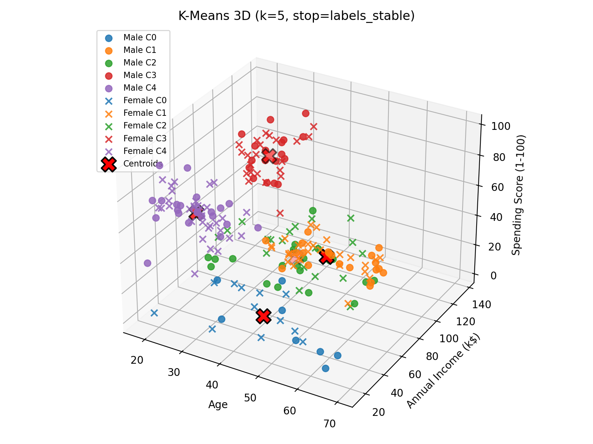
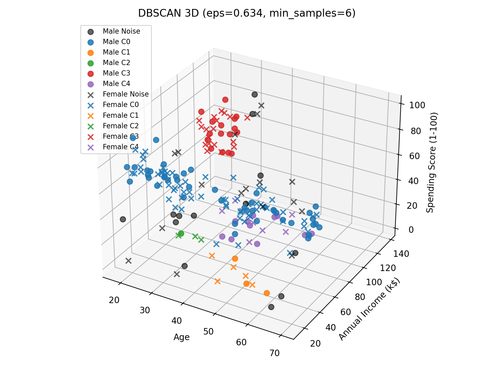
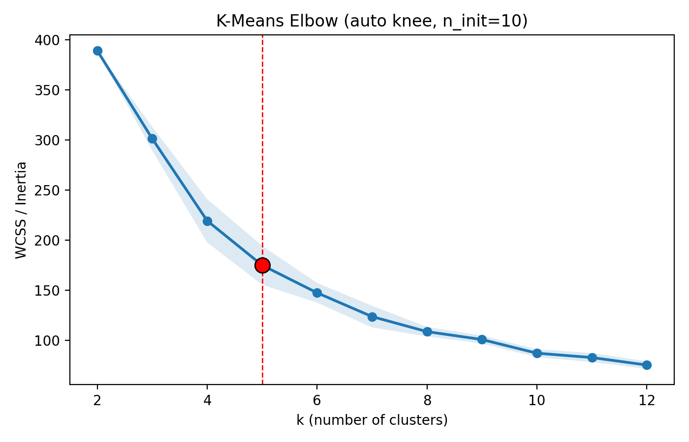
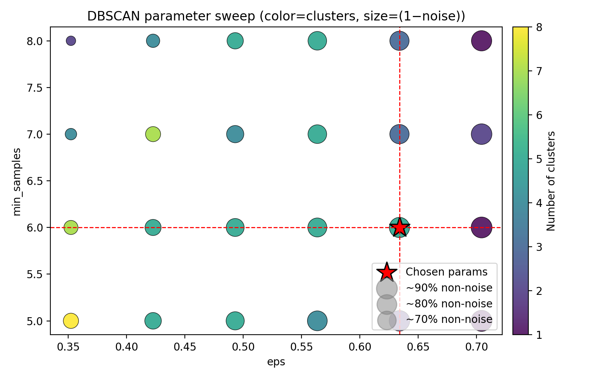

# Customer Segmentation using K-Means and DBSCAN

Implementation of two unsupervised clustering algorithms from scratch for customer segmentation using the Kaggle Mall Customers dataset.

This project was completed for **CSCI 6840 – Graduate Machine Learning**.

---

## Overview

The objective of this project was to identify groups of customers with similar purchasing behavior without using labeled data.

Two clustering algorithms were implemented and compared:

- K-Means
- DBSCAN (Density-Based Spatial Clustering of Applications with Noise)

Rather than relying on existing clustering implementations from machine learning libraries, both algorithms were implemented manually to better understand their underlying mechanics, parameter selection, convergence behavior, and evaluation.

---

## Features

- K-Means implementation from scratch
- k-means++ centroid initialization
- Multiple random initializations (`n_init`)
- Automatic elbow detection for selecting *k*
- DBSCAN implementation from scratch
- Automatic k-distance knee detection
- DBSCAN parameter sweep for ε and `min_samples`
- Z-score feature normalization
- 2D and 3D visualizations
- Interactive Plotly visualizations
- Cluster quality evaluation using:
  - Silhouette Score
  - Davies-Bouldin Index
  - Calinski-Harabasz Index

---

## Dataset

The project uses the **Mall Customers** dataset from Kaggle.

Features used:

- Age
- Annual Income
- Spending Score

Gender information was retained for visualization but excluded from clustering.

---

## Results

### K-Means

- Automatic elbow detection selected **k = 5**
- Silhouette Score ≈ **0.42**
- Produced five well-defined customer segments.

### DBSCAN

- Automatic parameter search followed by manual tuning
- Final parameters:
  - ε = **0.634**
  - min_samples = **6**
- Davies-Bouldin Index ≈ **1.12**
- Calinski-Harabasz Index ≈ **34.3**
- Identified approximately **7.5%** of customers as outliers/noise.

---

## Example Output

### K-Means Clustering



### DBSCAN Clustering



### Automatic Elbow Detection



### DBSCAN Parameter Selection



---

## Repository Structure

```
Clustering/
│
├── clustering.py
├── requirements.txt
├── README.md
│
├── docs/
│ ├── Assignment.pdf
│ ├── Report.pdf
│ └── Presentation.pdf
│
└── images/
```

---

## Requirements

```bash
python -m pip install -r requirements.txt
```

---

## Running

```bash
python clustering.py
```

The program will:

- Normalize the dataset
- Execute K-Means
- Execute DBSCAN
- Evaluate cluster quality
- Generate all plots
- Produce interactive Plotly visualizations

---

## Skills Demonstrated

- Unsupervised Machine Learning
- Clustering Algorithms
- Numerical Computing
- Algorithm Design
- Data Visualization
- Model Evaluation
- Scientific Python