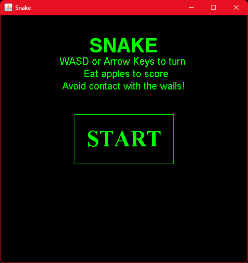
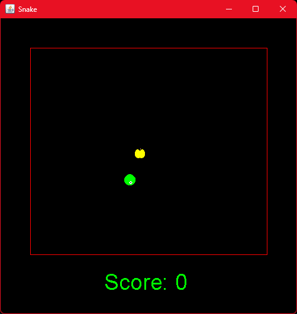
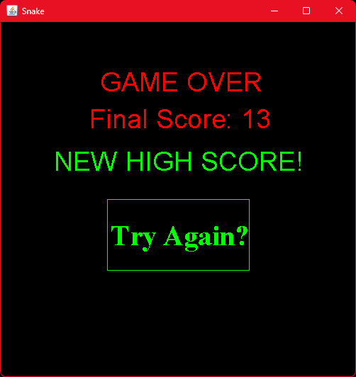
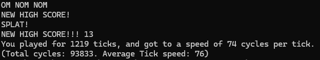

# Java Snake Game

A Snake-inspired desktop game developed in Java Swing for an early programming course assignment. This was created during my second programming course and was one of my first complete interactive applications.

The game uses custom Java2D polygon rendering rather than external graphics assets or game-development libraries.

The assignment required an original interactive Swing game with a polygon-based animated avatar, user controls, scoring, and start/end screens; this implementation additionally includes progressive difficulty, replay support, persistent session high scores, randomized collectibles, and console statistics.

## Original Assignment

The original course assignment is included for context:

[View the original assignment requirements](assignment/CSCI-1302-Assignment-2.pdf)

## Features

- Keyboard controls using WASD or the arrow keys
- Custom-rendered animated snake graphics
- Randomized collectible placement
- Collision detection
- Progressive speed increases
- Current-score and high-score tracking
- Start and game-over screens
- Mouse-hover and click interaction
- Replay support

## Technologies

`Java` `Swing` `AWT` `Java2D`

## Running the Project

Requires Java Development Kit 17 or newer.

The project was originally developed and run through Eclipse. The commands below compile and run the preserved source directly from the command line.

Compile:

```bash
javac -d out src/snake_game/Csci1302_hw2.java src/snake_game/DrawPoly.java
```

Run:

```bash
java -cp out snake_game.Csci1302_hw2
```

## Project Context

This project was originally completed in February 2022 as the second assignment in my second programming course. It is preserved as an example of my early programming work and progression as a software developer.

## Application Images

<p align="center">
  
  
  
</p>

<p align="center">
  
</p>