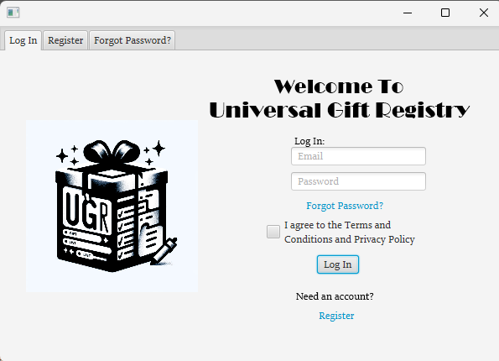
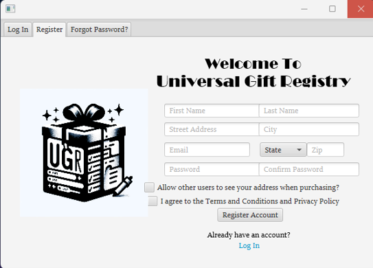
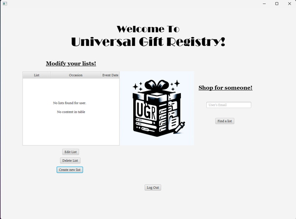
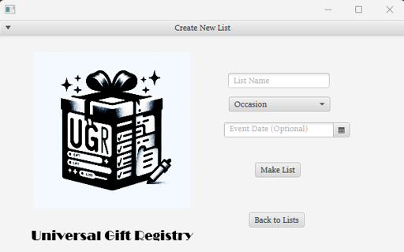
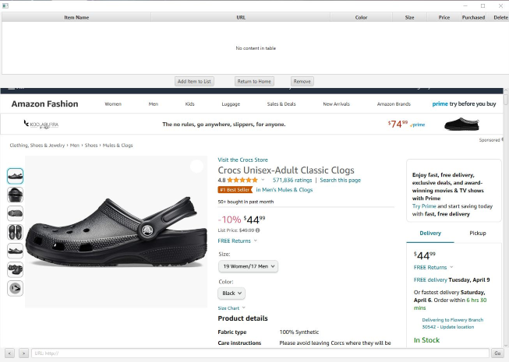
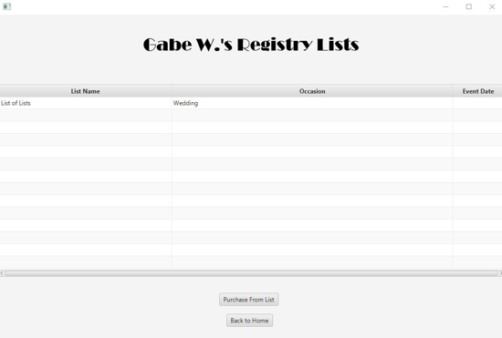
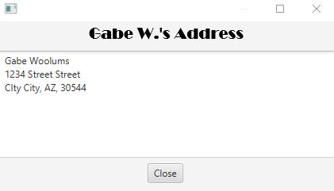

# Universal Gift Registry — Java Implementation

A desktop gift-registry application developed in Java and JavaFX as part of a four-person software engineering project for **CSCI 3300 – Software Engineering**.

The application allows users to create accounts, manage multiple gift registries, add products from Amazon, search for other users’ registries, mark items as purchased, and access shipping information when the registry owner has chosen to make it available.

This implementation uses a JavaFX graphical interface, an MVC-inspired application structure, Maven dependency management, and an Azure-hosted SQL database for persistent application data.

---

## Application Overview

The Universal Gift Registry was designed to provide a central location where users could create and share gift lists for occasions such as weddings, birthdays, graduations, holidays, and other events.

Users can:

- Register and log in
- Reset forgotten passwords using security questions
- Create and delete registry lists
- Add Amazon products to a registry
- Remove items from a registry
- Search for other users’ registries
- View another user’s available lists
- Mark products as purchased
- Access a registry owner’s shipping address when authorized
- Validate input and display contextual error messages

---

## Screenshots

### Login and Registration

<p align="center">
  
  
</p>

The login interface supports account authentication, registration, password recovery, and acceptance of the application’s terms and conditions.

---

### Registry Dashboard

<p align="center">
  
</p>

The main dashboard displays the current user’s lists and provides controls for creating, editing, and deleting registries. Users can also search for another account by email.

---

### Creating a Registry

<p align="center">
  
</p>

Users can create registries with a name, occasion, and optional event date.

---

### Adding Products

<p align="center">
  
</p>

The registry-management screen uses an embedded JavaFX `WebView` to browse Amazon. Product information can be captured and added to the selected registry.

---

### Viewing Other Users’ Registries

<p align="center">
  
</p>

Users can search by email and view the public registries associated with another account.

---

### Shipping Information

<p align="center">
  
</p>

When a registry owner enables address visibility, other users can access the supplied shipping information.

---

## Architecture

The application follows an MVC-inspired architecture:

- **View:** JavaFX GUI and FXML layouts
- **Controller:** Java application logic, navigation, validation, and event handling
- **Model:** Azure SQL database containing user, registry, and item data

The desktop client communicates with the SQL backend through parameterized queries and updates the interface in response to user actions and database state changes.

The broader system architecture and use-case documentation are available in the parent project’s [`docs`](../docs/) directory.

---

## Technologies

`Java`  
`JavaFX`  
`FXML`  
`Maven`  
`SQL`  
`Azure SQL Database`  
`JDBC`  
`JavaFX WebView`  
`CSS`  
`MVC`

---

## Project Structure

```text
Java-Implementation/
├── images/
│   ├── create_new_list.png
│   ├── list_screen_adding.png
│   ├── login_screen.png
│   ├── logo.png
│   ├── main_screen.png
│   ├── others_address.png
│   ├── others_lists.png
│   └── registration.png
│
├── src/
│   └── main/
│       ├── java/
│       │   └── application source code
│       └── resources/
│           ├── FXML layouts
│           ├── stylesheets
│           └── application assets
│
├── .mvn/
├── mvnw
├── mvnw.cmd
├── pom.xml
└── README.md
```

---

## Building the Project

This project uses the Maven Wrapper, so a separate Maven installation may not be required.

### Windows

```powershell
.\mvnw.cmd clean package
```

### Linux or macOS

```bash
./mvnw clean package
```

The exact launch command depends on the JavaFX and packaging configuration in `pom.xml`. After the source tree and Maven configuration are reviewed, this section should be updated with the verified command for launching the application.

---

## Runtime Requirements

The original implementation was developed using:

- **JDK 21**
- JavaFX
- Access to the project’s Azure SQL database

The application may not currently run as originally deployed if the Azure database, connection credentials, Amazon page structure, or other external dependencies are no longer available.

The source code, interface resources, screenshots, architecture documents, test artifacts, and user manual are preserved to document the completed implementation.

---

## Security and Validation

The project incorporates several defensive application practices:

- Parameterized SQL queries using `PreparedStatement`
- Input validation
- Email-format checking
- Password-complexity requirements
- Password confirmation
- Required-field enforcement
- Security-question verification
- Duplicate security-question prevention
- Graceful handling of unavailable database connections
- Selection validation before edit, delete, or purchase operations

---

## Project Context

This application was completed during Spring 2024 for **CSCI 3300 – Software Engineering**.

The project was developed by a four-person team using Scrum-based planning, GitHub for version control, Jira for task management, Maven for dependency management, JavaFX and FXML for the desktop interface, and Azure SQL for persistent storage.

The work included:

- Requirements and scope definition
- User stories
- Project scheduling
- Architecture and use-case modeling
- Front-end development
- Database integration
- Functional testing
- Defect identification and correction
- Installation packaging
- User documentation
- Final presentation and retrospective analysis

I served as the project team lead and contributed to the application architecture, Java development, database integration, testing, documentation, and project coordination.

---

## Documentation

Additional project documentation is available in the parent project:

- Original assignment description
- Project proposal
- Architecture diagram
- Use-case diagram
- Project schedule
- Test cases and results
- User manual
- Tools used
- Final presentation
- Lessons learned

See the [`docs`](../docs/) directory.

---

## Logo

<p align="center">
  
</p>

---

## Academic Project Notice

This repository preserves an academic team project and its original implementation. It is presented as evidence of software-engineering experience and technical development rather than as an actively maintained production service.