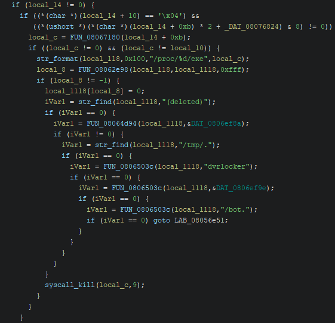
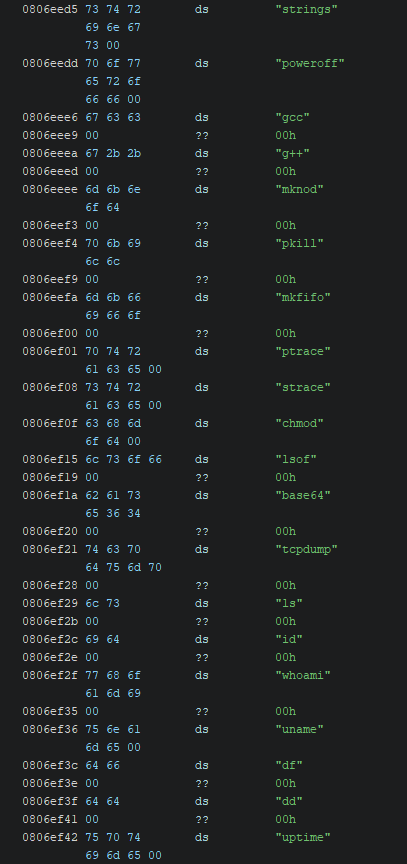
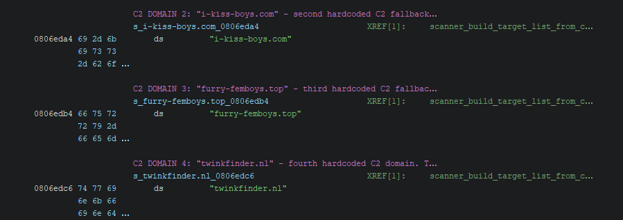

# Dismantling GayFemBoy: Reverse Engineering a 2025 Mirai IoT Botnet Derivative

## Responsible Disclosure

**This repository documents the analysis of live malware for educational, research, and defensive cybersecurity purposes.**

**No functional malware binaries, payloads, or tooling capable of deploying or propagating the sample are included.**

**All analysis was performed in a contained, air-gapped virtual machine network consisting of a Kali Purple machine for the actual analysis and a RemNux machine running INetSim to act as the internet.**

## Overview

This project presents a reverse engineering analysis of a contemporary Mirai-derived Linux IoT botnet. Using static analysis, dynamic debugging, runtime memory analysis, and controlled network observation, the malware's multi-stage execution pipeline was reconstructed from initial execution through the final payload.

## Repository Structure

```
Reverse_Engineering_Mirai_Derivative/
│
├── README.md
│
├── docs/
│   ├── dismantling_gayfemboy_report.pdf
│   ├── dismantling_gayfemboy_presentation.pdf
│   └── assignment.pdf
│
├── images/
│   ├── c2_domains.png
│   ├── process_kill_list.png
│   ├── process_kill_logic.png
│   └── child_liveness.png
│
└── workflow/
    ├── analysis_walkthrough.md
    ├── gdb_analysis_script.gdb
    └── reset_lab.sh
```

## Skills Utilized

| Discipline | Techniques |
|------|------------|
| Static | Ghidra, strings, objdump, binwalk |
| Dynamic | GDB, strace, ltrace |
| Network | INetSim, isolated virtual network |
| Runtime | Memory dumps, process monitoring | 

## Key Findings

- Multi-stage loader
- Runtime unpacking
- In-memory execution
- Self-deletion
### `/proc` Enumeration and Process Termination

The malware traverses `/proc` to enumerate running processes before selectively terminating competing processes and analysis utilities.



### Embedded Process Denylist

The final-stage payload contains an extensive list of process names used to identify competing malware and common analysis tools.



### Hardcoded Command-and-Control Domains

Several fallback C2 domains are embedded directly within the binary and are referenced sequentially during network initialization.



- Child-process liveness signaling
- Runtime memory remapping

The malware employs a multi-stage execution pipeline. The initial ELF exhibits high entropy across most of the binary, with only a small tail section containing the loader responsible for unpacking the second stage. The second stage performs additional unpacking, removes the original executable from disk, decrypts the final payload, remaps executable memory, and finally transfers execution into the primary malware logic. This layered design complicates static analysis and necessitates runtime observation to recover the complete execution flow.

## Documentation

- Research Paper (`docs/dismantling_gayfemboy_report.pdf`)
- Presentation (`docs/dismantling_gayfemboy_presentation.pdf`)
- Assignment (`docs/assignment.pdf`)
- Live Demonstration Walkthrough (`workflow/analysis_walkthrough.md`)