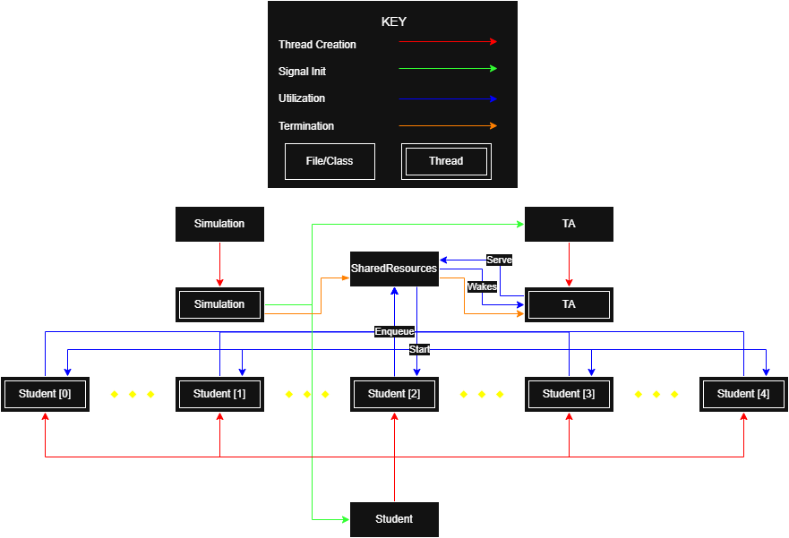

# Sleeping TA Synchronization Simulation

A multithreaded implementation of the classic **Sleeping Teaching Assistant** synchronization problem completed for **CSCI 6100 – Operating Systems and Systems Architecture**.

The project demonstrates thread synchronization using modern C++20 concurrency primitives, including mutexes, counting semaphores, binary semaphores, and coordinated thread lifecycles.

---

## Overview

The Sleeping TA problem models a teaching assistant who provides help to students during office hours.

- The TA serves one student at a time.
- Students alternate between programming and requesting help.
- A limited number of hallway chairs represent the waiting queue.
- Students finding the hallway full return later.
- When no students require assistance, the TA sleeps until awakened.

The simulation coordinates these interactions while preventing race conditions and maintaining correct synchronization.

---

## Features

- Modern C++20 implementation
- Multithreaded simulation
- FIFO waiting queue
- Counting semaphore synchronization
- Binary semaphore handshaking
- Mutex-protected critical sections
- Configurable timing parameters
- Detailed execution logging
- Simulation metrics and summary statistics

---

## Repository Contents

```text
Project description_fa25.pdf

System_Map.png

Presentation.pdf

Sleeping_TA/ {source code}
```

---

## Architecture



The project separates responsibilities into several independent components.

| Component | Responsibility |
|-----------|----------------|
| Simulation | Creates threads and manages the simulation lifecycle |
| SharedResources | Owns the shared queue and synchronization primitives |
| Student | Simulates student programming and help requests |
| TA | Services waiting students |
| StudentSync | Provides per-student synchronization |
| Logger | Thread-safe logging |
| SimulationConfig | Stores configurable timing and simulation parameters |

The overall interaction between these components is illustrated in the included architecture diagram.

---

## Synchronization Techniques

The simulation demonstrates several operating-system synchronization concepts.

### Mutexes

A shared mutex protects the waiting queue, ensuring mutual exclusion whenever students are added or removed.

### Counting Semaphores

A counting semaphore coordinates queued students with the TA, guaranteeing one permit for each waiting student.

### Binary Semaphores

Each student owns a pair of binary semaphores used to synchronize the beginning and completion of an individual help session.

### Thread Lifecycle

The simulation demonstrates orderly thread creation, synchronization, shutdown, and cleanup through explicit thread management and joining.

---

## Key Concepts

- Multithreading
- Mutual Exclusion
- Critical Sections
- Counting Semaphores
- Binary Semaphores
- Thread Synchronization
- Producer–Consumer Coordination
- Operating Systems

---

## Technologies

`C++20`

`std::thread`

`std::mutex`

`std::counting_semaphore`

`std::scoped_lock`

---

## Course Context

Completed for **CSCI 6100 – Operating Systems and Systems Architecture**.

The assignment required implementing the classical Sleeping Teaching Assistant synchronization problem using threads and synchronization mechanisms such as mutexes and semaphores. The implementation emphasizes modular software design in addition to correct concurrent execution.